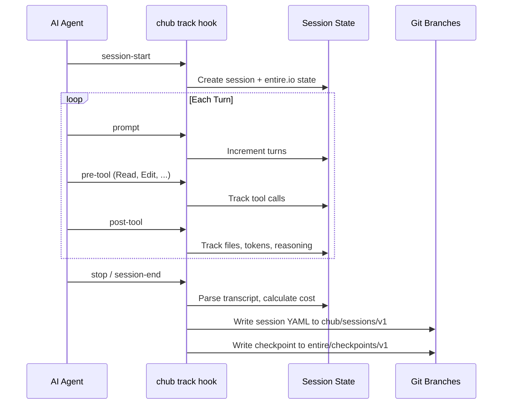

# AI Usage Tracking

Track AI coding agent activity per-project — sessions, tool calls, models, tokens, reasoning, and estimated costs. Agent-agnostic: works with Claude Code, Cursor, Copilot, Gemini CLI, Codex, and more. Team-visible summaries are committed alongside code; full transcripts stay local.

## Quick Start

```sh
chub track enable          # install hooks (auto-detects your agent)
# ... use your AI agent as normal ...
chub track status          # see active session
chub track log             # session history
chub track report          # aggregate usage report
```

## How It Works

`chub track enable` installs lightweight hooks into your AI agent's config. These hooks fire on lifecycle events and record session data automatically — no changes to your workflow. Chub is **agent-agnostic**: the same tracking pipeline works across Claude Code, Cursor, Copilot, Gemini CLI, and Codex.



## Data Architecture

Chub stores tracking data using orphan git branches (similar to [entire.io](https://entire.io)):

### Team-Visible Summaries

Session summaries are stored on the `chub/sessions/v1` orphan branch and pushed to remote via the `pre-push` git hook. Checkpoints (with prompts and attribution) go to the `entire/checkpoints/v1` branch. Contains metadata only, never full transcripts.

```yaml
session_id: "2026-03-22T10-05-abc123"
agent: "claude-code"
model: "claude-opus-4-6"
started_at: "2026-03-22T10:05:00Z"
ended_at: "2026-03-22T10:42:00Z"
duration_s: 2220
turns: 14
tokens:
  input: 45000
  output: 12000
  cache_read: 8000
  cache_write: 3000
  reasoning: 5500        # extended thinking / reasoning tokens (if used)
tool_calls: 23
tools_used: ["Read", "Edit", "Bash", "Grep"]
files_changed: ["src/main.rs", "src/lib.rs"]
commits: ["abc1234", "def5678"]
est_cost_usd: 0.85
env:
  os: "windows"
  arch: "x86_64"
  branch: "main"
  repo: "my-project"
  git_user: "Jane Developer"
  chub_version: "0.1.15"
  extended_thinking: true    # set when reasoning tokens are detected
```

### Local-Only Data

- **Transcripts** — `.git/chub/transcripts/` — archived conversations, viewable in the dashboard
- **Session journals** — `.git/chub-sessions/` — JSONL event logs with prompts and tool details
- **Session state** — `.git/entire-sessions/` — entire.io-compatible session state

None of these are pushed. Use `chub track clear` to delete at any time.

### Git Trailers & Hooks

Commits during a tracked session automatically get trailers:
- `Chub-Session: <id>` — links the commit to its session
- `Chub-Checkpoint: <id>` — links the commit to its checkpoint on the orphan branch

The `pre-push` hook pushes `chub/sessions/v1` and `entire/checkpoints/v1` alongside your code. Rebase operations are detected and skipped.

## Supported Agents

| Agent | Config File | Status |
|-------|------------|--------|
| **Claude Code** | `.claude/settings.json` | Full support |
| **Cursor** | `.cursor/hooks.json` | Full support |
| **GitHub Copilot** | `.github/hooks/chub-tracking.json` | Full support |
| **Gemini CLI** | `.gemini/settings.json` | Full support |
| **Codex CLI** | `.codex/config.toml` | Full support |
| **Aider** | `.aider.conf.yml` | Detection only |
| **Windsurf** | IDE config | Detection only |
| **Cline** | `.clinerules/hooks/` | Detection only |

::: tip Auto-Detection
When you run `chub track enable` without specifying an agent, chub detects which agents are set up in your project by checking for `.claude/`, `.cursor/`, `.github/`, `.gemini/`, and `.codex/` directories.
:::

## Hook Events

### Claude Code

| Hook | What it tracks |
|------|---------------|
| `SessionStart` | Creates session, links transcript file |
| `Stop` / `SessionEnd` | Finalizes session, parses transcript for tokens, calculates cost |
| `UserPromptSubmit` | Records first prompt, increments turn count |
| `PreToolUse` | Increments step count and tool call counter |
| `PostToolUse` | Tracks file changes from Write/Edit tools |

### Cursor

| Hook | What it tracks |
|------|---------------|
| `sessionStart` | Creates session |
| `sessionEnd` / `stop` | Finalizes session |
| `beforeSubmitPrompt` | Tracks prompts |

### Gemini CLI

| Hook | What it tracks |
|------|---------------|
| `SessionStart` | Creates session |
| `SessionEnd` | Finalizes session |
| `BeforeTool` | Tracks tool calls |
| `AfterTool` | Tracks file changes |

### GitHub Copilot

| Hook | What it tracks |
|------|---------------|
| `sessionStart` | Creates session |
| `sessionEnd` | Finalizes session |
| `userPromptSubmitted` | Tracks prompts |
| `preToolUse` | Counts tool calls |
| `postToolUse` | Tracks file changes |

### Codex CLI

| Hook | What it tracks |
|------|---------------|
| `SessionStart` | Creates session |
| `Stop` | Finalizes session |
| `UserPromptSubmit` | Tracks prompts |
| `AfterToolUse` | Tracks tool usage |

### Git Hooks

| Hook | Purpose |
|------|---------|
| `prepare-commit-msg` | Adds `Chub-Session: <id>` trailer |
| `post-commit` | Snapshots session summary |

Existing git hooks are preserved — chub backs them up and chains execution.

## Cost Estimation

Chub estimates costs using built-in rates for popular models:

| Model | Input / 1M tokens | Output / 1M tokens | Reasoning / 1M tokens |
|-------|-------------------|-------------------|---------------------|
| Claude Opus | $15.00 | $75.00 | $75.00 |
| Claude Sonnet | $3.00 | $15.00 | $15.00 |
| Claude Haiku | $0.80 | $4.00 | $4.00 |
| GPT-4o | $2.50 | $10.00 | $10.00 |
| GPT-4o Mini | $0.15 | $0.60 | $0.60 |
| o3 / o1 | $10.00 | $40.00 | $40.00 |
| Gemini Pro | $1.25 | $5.00 | $5.00 |
| Gemini Flash | $0.075 | $0.30 | $0.30 |
| DeepSeek | $0.27 | $1.10 | $1.10 |

Reasoning tokens (extended thinking in Claude, chain-of-thought in o1/o3/Gemini) are tracked separately and priced at the output rate.

Override with custom rates in `.chub/config.yaml`:

```yaml
tracking:
  cost_rates:
    - model: "custom-model"
      input_per_m: 5.0
      output_per_m: 20.0
      cache_read_per_m: 0.5
      cache_write_per_m: 6.25
```

## Web Dashboard

Launch a local dashboard for visual session tracking:

```sh
chub track dashboard               # http://localhost:4243
chub track dashboard --port 8080   # custom port
```

The dashboard shows:
- Active session indicator
- Total sessions, cost, and token usage
- Agent and model breakdowns
- Session history table
- Top tools chart
- Auto-refreshes every 10 seconds

### JSON API

The dashboard exposes a REST API:

| Endpoint | Description |
|----------|-------------|
| `GET /api/status` | Current tracking status |
| `GET /api/sessions?days=N` | Session list |
| `GET /api/report?days=N` | Aggregate report |
| `GET /api/session?id=X` | Single session detail |
| `GET /api/entire-states` | entire.io session states |

## entire.io Compatibility

Chub writes session state compatible with [entire.io](https://entire.io), stored in `.git/entire-sessions/`. This means:

- `entire status` reads chub-tracked sessions
- `entire doctor` validates chub session states
- Both tools can coexist without conflict

## Privacy

- **Summaries** (`.chub/sessions/`): Metadata only. No prompts, no code. Safe to share.
- **Journals** (`.git/chub-sessions/`): Contains prompts and tool data. Local-only.
- **entire.io states** (`.git/entire-sessions/`): Local-only.

Run `chub track clear` to delete all local transcripts.

## CLI Reference

| Command | Description |
|---------|-------------|
| `chub track enable [agent]` | Install hooks (auto-detect if omitted) |
| `chub track enable --force` | Overwrite existing hooks |
| `chub track disable` | Remove all hooks |
| `chub track status` | Show active session and tracking state |
| `chub track log [--days N]` | Session history (default 30 days) |
| `chub track show <id>` | Full session details |
| `chub track report [--days N]` | Aggregate cost/token/model report |
| `chub track export [--days N]` | JSON export for external tools |
| `chub track clear` | Delete local transcripts |
| `chub track dashboard` | Launch web dashboard |

All commands support `--json` for structured output.
