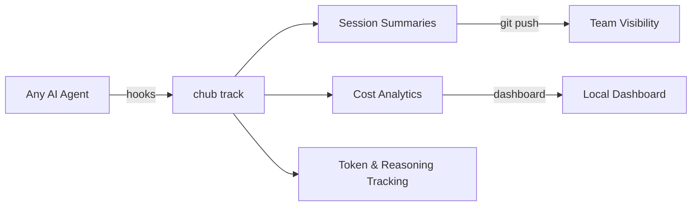

# Why Chub

## Three problems, one tool

AI coding agents are transforming software development. But as teams adopt them, three problems emerge — and they're all connected:

1. **Context** — Agents hallucinate APIs, use deprecated endpoints, and forget what they learned. You paste docs into chat; they get lost in context. Teammates paste different docs. Nobody's on the same page.

2. **Visibility** — You have no idea how much AI is costing your team. Which agents are being used? How many tokens? What models? Is that $500/month worth it? Nobody knows, because there's no tracking.

3. **Knowledge** — When an agent discovers a gotcha with a library, that knowledge evaporates when the session ends. Next week, a teammate's agent hits the exact same issue. The team never compounds what it learns.

These aren't three separate problems. They're one problem: **there's no infrastructure layer for AI coding agents.**

Chub is that layer.

```
┌─────────────────────────────────────────────────────────────┐
│                        Chub                                 │
│                                                             │
│   📚 Context          📊 Tracking         🧠 Learning       │
│   Curated docs        Session lifecycle   Structured        │
│   Version pinning     Token & cost        annotations       │
│   Project context     analytics           that compound     │
│   Profile scoping     Multi-agent         across the        │
│   Dep detection       dashboards          entire team       │
│                                                             │
└─────────────────────────────────────────────────────────────┘
```

## The context problem

We've all been there. You ask your AI coding agent to integrate Stripe webhooks. It writes confident, clean code — using an API that was deprecated two versions ago. You correct it. It apologizes, rewrites. This time it uses `express.json()` before the webhook signature check, which silently breaks verification. You fix it again. Next week, a teammate hits the exact same issue. The agent has no memory. It learned nothing.

This is not a model problem. This is a context problem.

AI coding agents are powerful reasoners, but they operate in a knowledge vacuum. They don't know which API version your team uses. They don't know about the gotcha your senior dev discovered last Tuesday. They apply general rules to specific codebases — and when those general rules are wrong, the whole team pays for it in wasted cycles, reverted PRs, and eroded trust.

## Why we were excited about Context Hub

When Andrew Ng's team released [Context Hub](https://github.com/andrewyng/context-hub), we saw someone finally framing the problem correctly. Instead of hoping models would know every API, Context Hub gave agents a curated library of versioned documentation — accurate, maintained, and retrievable on demand.

The idea was right. Give agents the docs they need, when they need them. Stop relying on training data that's months out of date.

We started using it. It helped. Agents stopped hallucinating API signatures as often. But the more we used it, the more we noticed what was missing.

## What was still missing

Serving docs is necessary but not sufficient. The most valuable knowledge on any team isn't in public documentation — it's in the hard-won lessons that developers accumulate through debugging, shipping, and reviewing each other's code:

- *"That endpoint requires raw body parsing — don't use JSON middleware before it."*
- *"We're locked to v15.0.0 until the migration is done."*
- *"The batch endpoint is 10x cheaper than individual calls for our use case."*

None of that is on the public internet. No doc server will ever have it. And without it, agents keep rediscovering the same pitfalls — burning time, introducing bugs, and requiring human intervention for problems that were already solved.

We also noticed that Context7 — which had gained significant traction — was solving a related but different problem. Context7 crawls public library docs and serves them fresh. That's valuable. But it's a read-only pipe. The agent consumes docs, uses them, and whatever it learns in the process evaporates when the session ends.

We wanted something more. We wanted agents that **learn**.

## The insight: learning is a natural skill for coding agents

Think about how a good developer grows. They don't just read documentation — they build, hit problems, figure out workarounds, and share what they learned with the team. Over time, the team's collective knowledge compounds. New hires ramp up faster because the hard lessons are already captured.

Why shouldn't AI agents work the same way?

Learning — recording what worked, what broke, what to avoid — should be a natural capability of any coding agent. Not a nice-to-have. A core skill. An agent that uses a library, discovers a gotcha, and writes it down for the next agent is fundamentally more valuable than one that just follows generic rules.

This is the thesis behind Chub: **the knowledge base should get smarter every time an agent touches it.**

## So we built Chub

We took the foundation Context Hub laid down — curated docs, versioned entries, CLI + MCP serving — and rebuilt it in Rust with four goals:

### Make it fast enough to disappear

An MCP tool that takes a full second to respond breaks the agent's flow. We rewrote the search pipeline with BM25 inverted indexing instead of linear scan, compiled to a native binary, and got search down from 1,060ms to 56ms. Cold start: 44ms. The tool should feel instant — like it was always part of the agent's mind.

| Operation | Context Hub (JS) | Chub (Rust) | Improvement |
|---|---|---|---|
| Search | 1,060 ms | **56 ms** | **19x faster** |
| Validate only | 1,920 ms | **380 ms** | **5x faster** |
| Build (1,560 entries) | 3,460 ms | **1,770 ms** | **2x faster** |
| Get (cached doc) | 148 ms | **63 ms** | **2.3x faster** |
| Cold start | 131 ms | **44 ms** | **3x faster** |
| Peak memory (build) | ~122 MB | **~23 MB** | **5.3x less** |
| Package size | ~22 MB | **10 MB** | Single binary, no runtime deps |

### Make agents that learn from every session

When an agent resolves something non-obvious, it should write that knowledge back — structured, categorized, and automatically surfaced to future agents. We built a three-tier annotation system:

**Structured annotation kinds:**

| Kind | What it captures |
|------|-----------------|
| `issue` | Confirmed bug, broken param, misleading example |
| `fix` | Workaround that actually resolves the issue |
| `practice` | Convention or pattern the team has validated |
| `note` | General observation |

**What a generic doc server shows an agent:**
```
[openai/chat docs — official content only]
```

**What Chub shows the same agent:**
```
[openai/chat docs — official content]
---
[Team issue (high) — bob] tool_choice='none' silently ignores tools — returns null
[Team fix — bob] Use tool_choice='auto' or remove tools from the array
[Team practice — alice] Always set max_tokens; omitting it causes unbounded streaming cost
```

The second agent never has to discover any of this the hard way. Every session makes the next one better.

**Three storage tiers** scale from solo developer to enterprise:
- **Personal** (`~/.chub/`) — your own notes, your machine
- **Team** (`.chub/` in repo) — git-tracked, shared via version control
- **Org** (annotation server) — company-wide knowledge, cached locally

### Make teams work as one

Individual developers can get by with ad-hoc context. Teams cannot. When five developers and their AI agents are working on the same codebase, you need:

- **Doc pinning** — lock specific versions so every agent references the same API
- **Context profiles** — backend devs get API docs, frontend gets UI docs, with shared base rules inherited automatically
- **Agent config sync** — one source of truth that generates CLAUDE.md, .cursorrules, AGENTS.md, and 7 more targets
- **Project context** — architecture decisions, conventions, runbooks — served alongside public docs via MCP
- **Dep auto-detection** — scan your package.json, Cargo.toml, requirements.txt, and more and auto-pin matching docs
- **Doc snapshots** — point-in-time captures for reproducible builds
- **Freshness checks** — detect when pinned doc versions lag behind installed packages

All of this lives in `.chub/` inside your repo. If it's not in git, it doesn't exist for the team.

### Track what your agents actually do

You can't improve what you can't measure. Chub tracks AI coding agent activity across your entire team — sessions, tool calls, models, tokens, reasoning effort, and estimated costs — all stored alongside your code.

```sh
chub track enable          # install hooks (auto-detects your agent)
# ... use your AI agent as normal ...
chub track status          # see active session
chub track report          # aggregate usage report
chub track dashboard       # local web dashboard
```

**Agent-agnostic by design**: the same tracking pipeline works across Claude Code, Cursor, GitHub Copilot, Gemini CLI, Codex, and more. One command, any agent. No vendor lock-in.

Session data is stored on orphan git branches and pushed alongside your code — your whole team sees usage patterns, cost trends, and which agents are most effective for different tasks. Full transcripts stay local for privacy.



Key tracking features:
- **Session lifecycle** — start, prompts, tool calls, commits, stop — all recorded automatically
- **Cost estimation** — built-in rates for Claude, GPT, Gemini, DeepSeek, o1/o3, with custom rate overrides
- **Reasoning capture** — extended thinking tokens, thinking blocks, reasoning effort tracked separately
- **Environment metadata** — OS, architecture, git branch, repo, user — captured at session start
- **Web dashboard** — local dashboard with session history, cost charts, agent breakdowns, transcript viewer

## Respecting what came before

We want to be clear about where we stand.

Context Hub created this category. Andrew Ng's team saw that agents need curated documentation and built the infrastructure to serve it. Chub is fully format-compatible with Context Hub — same registry format, same search index, same config schema. Content works in both directions without modification. We didn't reinvent the format. We built on it.

Context7 validated the demand. Fifty thousand GitHub stars prove that developers want their AI agents to have accurate, up-to-date documentation. Context7 does public library freshness better than anyone — it crawls, it's always current, and it just works. We recommend running both. They're complementary:

```
Context7  →  "What does the Stripe API do?"     (public, crawled, always fresh)
Chub      →  "How does our team use Stripe?"     (private, annotated, version-pinned)
```

## Where we're going

We believe the three pillars — context, tracking, and learning — belong in one tool because they reinforce each other:

- **Context makes agents accurate.** When agents have the right docs and team knowledge, they write correct code on the first try.
- **Tracking makes usage visible.** When you can see sessions, costs, and tool patterns across your team, you make better decisions about how and where to use AI.
- **Learning makes agents smarter.** When agents write back what they discover, the knowledge compounds. A team that's been using Chub for six months has a knowledge base that a new team member (human or AI) can tap into on day one.

Other tools solve one of these. Context Hub and Context7 serve docs. Entire.io tracks sessions. But nobody connects them. Chub does — because the agent that serves your docs is the same agent that tracks your sessions and stores your annotations. One tool, one config, one `chub mcp` command.

Our goal: make Chub the agent-agnostic infrastructure layer for AI-assisted development. Not by replacing human judgment, but by making sure the lessons humans have already learned are never lost, the costs and patterns of AI usage are always transparent, and every agent on your team is as informed as your best engineer.

## Design Principles

1. **All-in-one** — context, tracking, and learning belong in one tool. They share config, share MCP, share git integration. No glue code needed.
2. **Agent-agnostic** — works with any AI coding agent. Claude Code, Cursor, Copilot, Gemini CLI, Codex — same tools, same data, no lock-in.
3. **Git-first** — team config, annotations, and session summaries live in the repo. If it's not in git, it doesn't exist for the team.
4. **Gradual adoption** — works for a solo developer today; adds team value when `.chub/` is committed.
5. **Three-tier inheritance** — personal → project → profile. No tier is required. Annotations, config, and pins all follow this pattern.
6. **Agent-native** — every feature is accessible via MCP. CLI is for humans, MCP is for agents.
7. **Zero cloud dependency** — everything works offline and self-hosted.
8. **Fast** — search in ~56ms, cold start in ~44ms. The tool should feel like it doesn't exist.

## Who is it for

- **Solo developers** who want their AI agents to stop hallucinating APIs and start using accurate docs
- **Teams** where multiple developers and AI agents need consistent context, shared knowledge, and usage visibility
- **Engineering leads** who need to understand how AI agents are being used, what they cost, and where they're most effective
- **Organizations** that want git-tracked, reviewable, compounding knowledge with cost analytics across projects
- **Anyone** who believes the tools around AI coding agents should be as good as the agents themselves

## Detailed comparisons

- [Chub vs Context Hub](/guide/vs-context-hub) — performance benchmarks, feature comparison, format compatibility
- [Chub vs Context7](/guide/vs-context7) — different problems, complementary tools, how to run both
