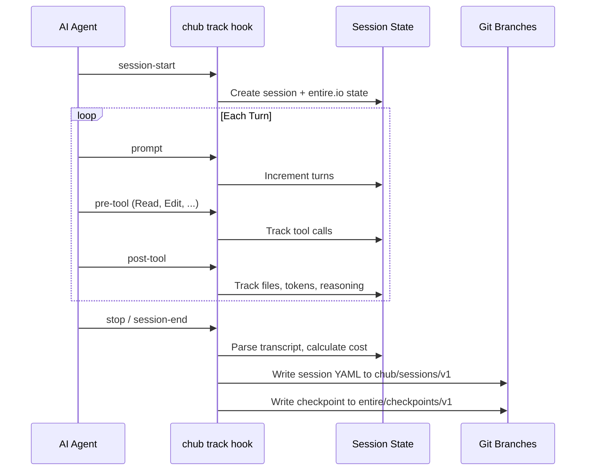
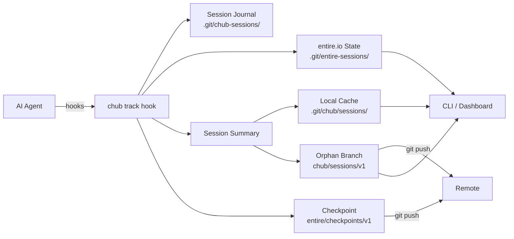

# AI Usage Tracking

Chub tracks AI coding agent activity per-project — sessions, tool calls, models, tokens, reasoning, and costs — stored alongside code for team visibility. Agent-agnostic: works with Claude Code, Cursor, Copilot, Gemini CLI, Codex, and more.

## Quick Start

```sh
chub track enable          # install hooks (auto-detects your agent)
# ... use your AI agent as normal ...
chub track status          # see active session
chub track log             # session history
chub track report          # aggregate usage report
chub track dashboard       # local web dashboard
```

## How It Works

When you run `chub track enable`, chub installs lightweight hooks into your AI agent's config. These hooks fire on lifecycle events (session start, prompts, tool calls, commits) and record session data. Chub is **agent-agnostic** — the same tracking pipeline works across Claude Code, Cursor, Copilot, Gemini CLI, and Codex.

### Session Lifecycle



### Data Flow



### Data Tiers

| Tier | Location | Visibility | Content |
|------|----------|------------|---------|
| **Session summaries** | `chub/sessions/v1` branch | Pushed via pre-push hook | Metadata: agent, model, tokens, cost, files changed |
| **Session cache** | `.git/chub/sessions/` | Local only | Fast local copy of session YAMLs |
| **Checkpoints** | `entire/checkpoints/v1` branch | Pushed via pre-push hook | Checkpoint metadata, prompts, attribution |
| **Transcripts** | `.git/chub/transcripts/` | Local only | Archived conversation transcripts |
| **Session journal** | `.git/chub-sessions/` | Local only | JSONL events with prompts and tool details |
| **entire.io state** | `.git/entire-sessions/` | Local only | Cross-compatible session state (camelCase JSON) |
| **Git trailers** | Commit messages | Git-tracked | `Chub-Session` + `Chub-Checkpoint` linking commits |

### Session Summary Example

```yaml
session_id: "2026-03-22T10-05-abc123"
agent: "claude-code"
model: "claude-opus-4-6"
started_at: "2026-03-22T10:05:00Z"
ended_at: "2026-03-22T10:42:00Z"
duration_s: 2220
turns: 14
tokens:
  input: 45000
  output: 12000
  cache_read: 8000
  cache_write: 3000
  reasoning: 5500        # extended thinking / reasoning tokens (if used)
tool_calls: 23
tools_used: ["Read", "Edit", "Bash", "Grep"]
files_changed: ["src/main.rs", "src/lib.rs"]
commits: ["abc1234", "def5678"]
est_cost_usd: 0.85
env:
  os: "windows"
  arch: "x86_64"
  branch: "main"
  repo: "my-project"
  git_user: "Jane Developer"
  chub_version: "0.1.15"
  extended_thinking: true    # set when reasoning tokens are detected
```

## Supported Agents

| Agent | Hook Format | Config File | Status |
|-------|------------|------------|--------|
| **Claude Code** | JSON hooks in settings | `.claude/settings.json` | Full support |
| **Cursor** | JSON hooks file | `.cursor/hooks.json` | Full support |
| **GitHub Copilot** | JSON hooks file | `.github/hooks/chub-tracking.json` | Full support |
| **Gemini CLI** | JSON hooks in settings | `.gemini/settings.json` | Full support |
| **Codex CLI** | TOML `[[hooks]]` | `.codex/config.toml` | Full support |
| **Aider** | lint/test hooks only | `.aider.conf.yml` | Detection only |
| **Windsurf** | IDE settings hooks | IDE config | Detection only |
| **Cline** | Executable scripts | `.clinerules/hooks/` | Detection only |
| **OpenCode** | JS/TS plugins | `.opencode/plugins/` | Detection only |

### Claude Code Hooks

Chub installs these hooks in `.claude/settings.json`:

| Hook | Event | What it tracks |
|------|-------|---------------|
| `SessionStart` | Agent session begins | Creates session, links transcript |
| `Stop` | Agent stops | Finalizes session, calculates cost |
| `SessionEnd` | Session ends | Backup finalization |
| `UserPromptSubmit` | User sends prompt | Records first prompt, increments turns |
| `PreToolUse` | Before tool call | Increments tool count |
| `PostToolUse` | After tool call | Tracks file touches from Write/Edit |

### Cursor Hooks

Installed in `.cursor/hooks.json`:

| Hook | Event |
|------|-------|
| `sessionStart` | Creates session |
| `sessionEnd` | Finalizes session |
| `beforeSubmitPrompt` | Tracks prompts |
| `stop` | Backup finalization |

### Gemini CLI Hooks

Installed in `.gemini/settings.json`:

| Hook | Event |
|------|-------|
| `SessionStart` | Creates session |
| `SessionEnd` | Finalizes session |
| `BeforeTool` | Tracks tool calls |
| `AfterTool` | Tracks file changes |

### GitHub Copilot Hooks

Installed as `.github/hooks/chub-tracking.json`:

| Hook | Event |
|------|-------|
| `sessionStart` | Creates session |
| `sessionEnd` | Finalizes session |
| `userPromptSubmitted` | Tracks prompts |
| `preToolUse` | Counts tool calls |
| `postToolUse` | Tracks file changes |

### Codex CLI Hooks

Appended to `.codex/config.toml` as `[[hooks]]` entries:

| Hook | Event |
|------|-------|
| `SessionStart` | Creates session |
| `Stop` | Finalizes session |
| `UserPromptSubmit` | Tracks prompts |
| `AfterToolUse` | Tracks tool usage |

Note: Codex CLI does not yet support pre-tool blocking hooks.

### Git Hooks

Installed in `.git/hooks/`:

| Hook | Purpose |
|------|---------|
| `prepare-commit-msg` | Adds `Chub-Session` and `Chub-Checkpoint` trailers to commits |
| `post-commit` | Creates checkpoint on `entire/checkpoints/v1` branch, records commit hash |
| `pre-push` | Pushes `chub/sessions/v1` and `entire/checkpoints/v1` branches to remote |

If a git hook already exists, chub backs it up to `<hook>.pre-chub` and chains execution.

Chub automatically skips trailer insertion and checkpoint creation during `git rebase`.

## CLI Commands

### `chub track enable [agent]`

Install hooks for the specified agent, or auto-detect if omitted.

```sh
chub track enable              # auto-detect agent
chub track enable claude-code  # specific agent
chub track enable --force      # overwrite existing hooks
```

### `chub track disable`

Remove all chub hooks from agent configs and git hooks.

### `chub track status`

Show the active session, detected agent/model, and tracking state.

```sh
chub track status
# Active session:
#   ID:      2026-03-22T10-05-abc123
#   Agent:   claude-code
#   Model:   claude-opus-4-6
#   Started: 2026-03-22T10:05:00Z
#   Turns:   14
#   Tools:   23 calls
#   Tokens:  45000 in / 12000 out
```

### `chub track log [--days N]`

Show session history for the last N days (default 30).

### `chub track show <session-id>`

Show full details for a specific session.

### `chub track report [--days N]`

Aggregate usage report: total cost, model breakdown, top tools, files changed.

### `chub track export [--days N]`

Export session data as JSON for external dashboards.

### `chub track clear`

Delete local session journals (`.git/chub-sessions/`). Does not remove team-visible summaries.

### `chub track dashboard [--port 4243] [--host 127.0.0.1]`

Launch a local web dashboard at `http://localhost:4243` with:

- Summary cards (total sessions, cost, tokens, active session)
- Agent and model breakdowns
- Session history table
- Top tools chart
- entire.io session state viewer
- Auto-refresh every 10 seconds
- Conversation viewer (click a session to see the transcript)
- JSON API at `/api/status`, `/api/sessions`, `/api/report`, `/api/transcript`, `/api/entire-states`

### `chub track hook <event>`

Internal hook handler called by agent hooks. Not intended for direct use.

Events: `session-start`, `stop`, `prompt`, `pre-tool`, `post-tool`, `commit-msg`, `post-commit`, `pre-push`.

## Cost Estimation

Chub estimates costs using built-in token rates for popular models:

| Model Family | Input (per 1M) | Output (per 1M) | Reasoning (per 1M) |
|-------------|----------------|-----------------|-------------------|
| Claude Opus | $15.00 | $75.00 | $75.00 |
| Claude Sonnet | $3.00 | $15.00 | $15.00 |
| Claude Haiku | $0.80 | $4.00 | $4.00 |
| GPT-4o | $2.50 | $10.00 | $10.00 |
| GPT-4o Mini | $0.15 | $0.60 | $0.60 |
| o3 / o1 | $10.00 | $40.00 | $40.00 |
| Gemini Pro | $1.25 | $5.00 | $5.00 |
| Gemini Flash | $0.075 | $0.30 | $0.30 |
| DeepSeek | $0.27 | $1.10 | $1.10 |

Reasoning tokens (extended thinking in Claude, chain-of-thought in o1/o3/Gemini) are tracked separately and priced at the output rate. When extended thinking is active, the `reasoning` field appears in token breakdowns.

### Custom Rates

Override rates in `.chub/config.yaml`:

```yaml
tracking:
  cost_rates:
    - model: "claude-opus-4"
      input_per_m: 15.0
      output_per_m: 75.0
    - model: "custom-model"
      input_per_m: 5.0
      output_per_m: 20.0
      cache_read_per_m: 0.5
      cache_write_per_m: 6.25
```

## entire.io Compatibility

Chub implements the same tracking architecture as [entire.io](https://entire.io):

| Feature | entire.io | chub |
|---------|-----------|------|
| Session state | `.git/entire-sessions/<id>.json` | `.git/entire-sessions/<id>.json` (same) |
| Checkpoint branch | `entire/checkpoints/v1` | `entire/checkpoints/v1` (same) |
| Checkpoint sharding | `<id[:2]>/<id[2:]>/` | `<id[:2]>/<id[2:]>/` (same) |
| Metadata format | camelCase JSON (`checkpointID`, `sessionID`) | camelCase JSON (same) |
| Session summaries | _(not applicable)_ | `chub/sessions/v1` branch |
| Commit trailers | `Entire-Checkpoint: <id>` | `Chub-Session` + `Chub-Checkpoint` |
| Pre-push sync | Pushes `entire/checkpoints/v1` | Pushes both branches |
| Rebase detection | Skips during rebase | Skips during rebase |
| Stale cleanup | 7-day auto-delete | 7-day auto-delete |
| Phase machine | IDLE/ACTIVE/ENDED | active/idle/ended |

Both systems can coexist — chub and entire hooks run independently without conflict. `entire status` sees sessions tracked by chub, and vice versa.

## MCP Tool

The `chub_track` MCP tool lets agents query their own usage:

```
"What sessions ran today?"
"How many tokens have I used this week?"
"What's my estimated cost?"
```

Available via `chub mcp` alongside other chub MCP tools.

## Storage Architecture

Chub uses an orphan branch approach (similar to [entire.io](https://entire.io)) to share session data without polluting the main branch:

```
chub/sessions/v1 (orphan branch)         # Team-visible session summaries
├── ab/2026-03-22T10-05-abc123.yaml      # Sharded by session ID hex prefix
├── cd/2026-03-22T11-30-cdef01.yaml
└── ...

entire/checkpoints/v1 (orphan branch)    # Checkpoint metadata + prompts
├── 6b/2b1a06cee7/
│   ├── metadata.json                    # Root checkpoint summary
│   └── 0/
│       ├── metadata.json                # Per-session metadata
│       └── prompt.txt                   # User prompt at checkpoint
└── ...

.git/chub/ (local-only)
├── sessions/                            # Fast local cache of session YAMLs
└── transcripts/                         # Archived conversation transcripts

.git/entire-sessions/ (local-only)
└── <session-id>.json                    # entire.io-compatible session state
```

Branches are pushed automatically via the `pre-push` git hook. After `git fetch`, you can see team members' sessions in the dashboard or via `chub track log`.

## Privacy

- **Session summaries** on `chub/sessions/v1` contain metadata only — no prompts or code content. Pushed to remote.
- **Checkpoints** on `entire/checkpoints/v1` contain prompts and attribution stats. Pushed to remote.
- **Transcripts** in `.git/chub/transcripts/` contain full conversations. Local-only, never pushed.
- **Session journals** in `.git/chub-sessions/` contain detailed events. Local-only.
- Use `chub track clear` to delete local data at any time.

## Troubleshooting

### Hooks not firing

1. Verify hooks are installed: `chub track status`
2. Check agent config: `.claude/settings.json` or `.cursor/hooks.json`
3. Reinstall: `chub track enable --force`

### No cost estimates

Cost estimation requires a known model name. Check that your agent's model is detected:

```sh
chub track status --json | jq .model_detected
```

### entire.io conflicts

Chub and entire.io hooks can coexist. If both are installed, sessions may be tracked twice. Use `chub track disable` to remove chub's hooks if you prefer entire.io-only tracking.
